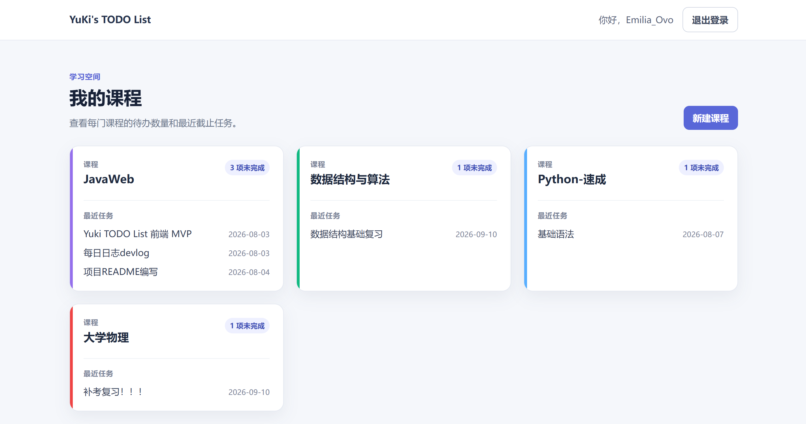
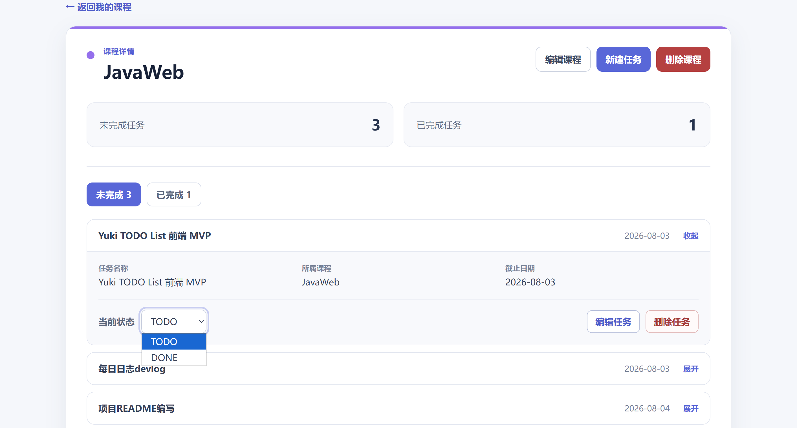

# YuKi's TODO List

一款面向大学生、以课程为中心的个人学习任务管理器。

## 项目简介

YuKi's TODO List 用课程组织学习任务，帮助用户集中查看每门课程的待办数量、近期截止任务和已完成任务。项目采用前后端分离结构，通过 Session + Cookie 维护登录状态，当前最小 MVP 已完成浏览器验收。

## 项目预览

### 课程首页



### 课程详情与任务管理



## 已完成功能

- 用户注册、登录、Session 验证和二次确认退出登录。
- 课程列表与课程详情查询。
- 创建、编辑和二次确认删除课程，支持课程颜色。
- 按课程查询 `TODO` / `DONE` 任务。
- 创建、展开、编辑、删除任务及切换任务状态。
- 首页展示课程待办数量和最近截止的最多 3 条任务。
- 当前用户数据隔离，以及统一的参数校验和错误响应。

## 技术栈

### 后端

- Java 21
- Spring Boot 4.1.0
- Spring Web MVC、Validation、Spring Data JPA
- MySQL 8.0
- BCrypt 密码哈希
- Maven、JUnit、MockMvc

### 前端

- Vue 3、Composition API、`<script setup>`
- Vue Router
- Vite 8、JavaScript
- 原生 Fetch API、普通 CSS
- ESLint

## 项目结构

```text
yuki-todo-list/
├─ assets/screenshots/      # 项目页面截图
├─ backend/                 # Spring Boot 后端
│  └─ src/                  # 业务代码、配置和集成测试
├─ frontend/                # Vue 3 + Vite 前端
│  └─ src/                  # 页面、组件、路由、API 和样式
├─ docs/
│  ├─ api/                  # API 文档
│  ├─ database/             # 数据库设计和初始化 SQL
│  ├─ design/               # 页面结构设计
│  └─ devlog/               # 开发日志
├─ PROJECT_STATUS.md        # 当前真实项目进度
└─ README.md
```

## 环境要求

- JDK 21
- Apache Maven 3.9.x
- MySQL 8.0
- Node.js `^22.18.0 || >=24.12.0`
- npm

本地默认端口：MySQL `3306`、后端 `8080`、前端 `5173`。

## 本地运行

### 1. 获取项目代码

```powershell
git clone https://github.com/Emilia-tan-Ovo/yuki-todo-list.git
cd yuki-todo-list
```

### 2. 初始化数据库

确认 MySQL 8.0 已启动，然后在 MySQL 客户端中执行 [初始化 SQL](docs/database/sql/init.sql)：

```sql
SOURCE C:/path/to/yuki-todo-list/docs/database/sql/init.sql;
```

脚本会创建开发数据库 `yuki_todo` 以及 `users`、`courses`、`tasks` 三张表。

> 后端配置为 `spring.jpa.hibernate.ddl-auto=validate`，启动时只校验现有表结构，不会自动创建数据库或数据表。

### 3. 启动后端

后端当前连接本机 `yuki_todo`，数据库用户名为 `root`。请在启动后端的同一个 PowerShell 窗口中设置 `DB_PASSWORD`：

```powershell
cd backend
$env:DB_PASSWORD = "你的 MySQL root 密码"
mvn.cmd spring-boot:run
```

如果使用其他终端，请用该终端对应的方式设置同名环境变量，并确保 `mvn` 已加入 `PATH`。后端启动后监听 `http://localhost:8080`。

### 4. 启动前端

新开一个 PowerShell 窗口：

```powershell
cd frontend
npm.cmd install
npm.cmd run dev
```

浏览器访问 `http://localhost:5173/`。Vite 会把 `/api` 请求代理到 `http://localhost:8080`，并保留 Session Cookie。

可选检查：

```powershell
npm.cmd run lint
npm.cmd run build
```

## API 文档

认证、课程、任务接口及公共错误规则参见 [API 设计文档](docs/api/api-design.md)。

## 当前版本与项目状态

- 当前阶段：最小可用版本（MVP）已完成。
- API 设计版本：v0.1。
- 后端认证、课程和任务共 15 个接口已完成。
- MockMvc 任务模块集成测试共 23 个用例已通过。
- 前端认证、课程管理和任务管理核心流程已完成。
- Maven 编译、前端 ESLint、生产构建、Apifox 冒烟测试和浏览器完整业务验收均已通过。

更详细的进度记录参见 [PROJECT_STATUS.md](PROJECT_STATUS.md)。

## 后续计划

- 继续修复 MVP 回归中发现的问题，提升交互细节和代码可读性。
- 补充认证模块和课程模块的自动化测试。
- 在基础版本稳定后，再评估日历视图、任务统计和子任务等扩展功能。
